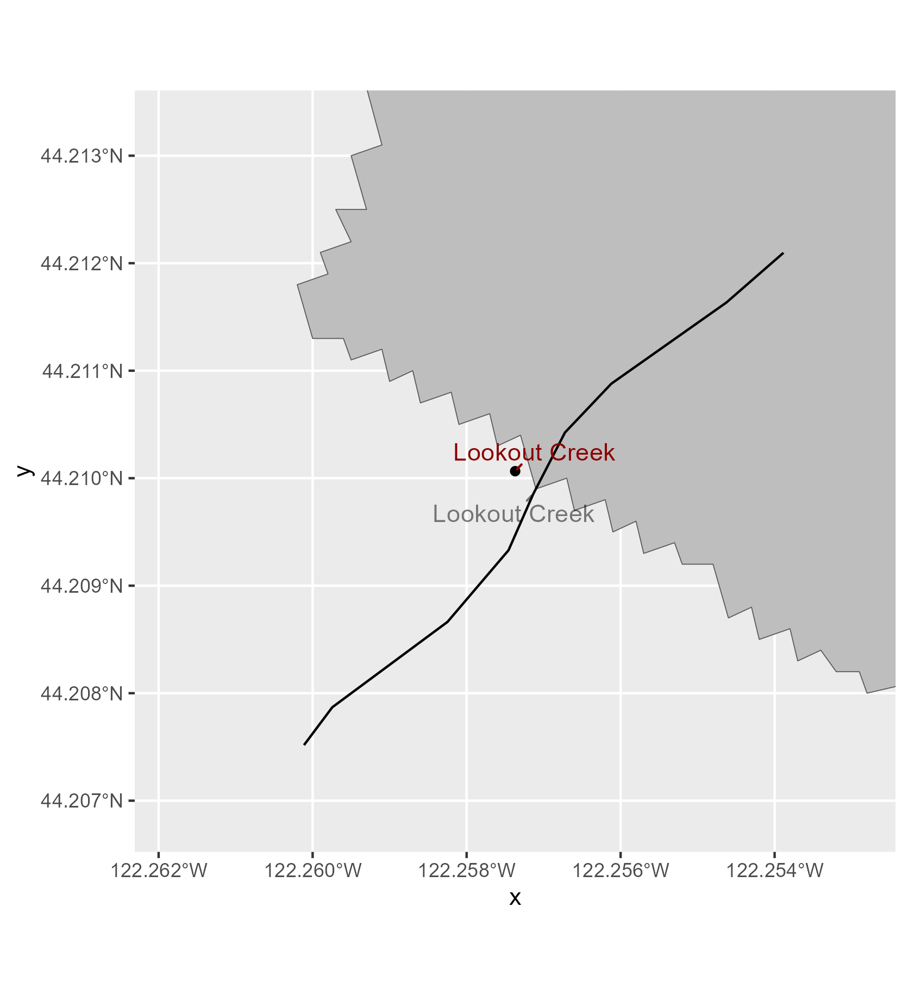
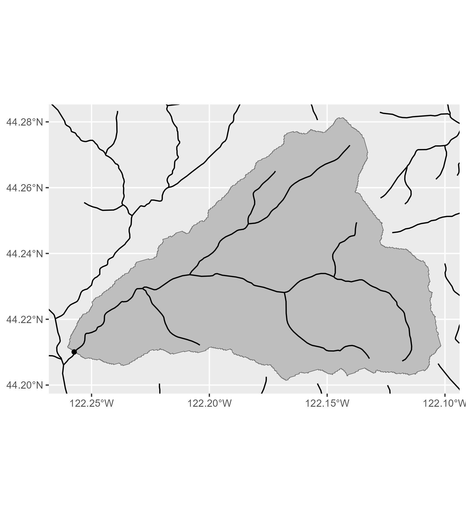

```{r setup, include=FALSE}
knitr::opts_chunk$set(echo = TRUE)
source(here::here("SOPs/Analysis/upstream-basins/util-functions.R")) #load util functions
library(magrittr) #for pipes
```

# Introduction

When studying watersheds it is often useful to consider the associated landscape and climate characteristics associated with a site and watershed. While it is easy to pull data (i.e., elevation, average precipitation) at the site location, this is often not representative of the entire basin which contributes streamflow to the sampling site.

In order to better describe the site and watershed characteristics we often average a metric across the upstream area using a shapefile of the area upstream from a site and spatial raster layer. However, obtaining a shapefile for the area upstream of a site is not a trivial process.

This script and workflow is used to obtain those upstream area basins for a set of sites using the USGS StreamStats [batch processor](https://streamstats.usgs.gov/ss/?BP=submitBatch) to obtain the basins.

# Getting Started

## Preparing the Data

To use this workflow you need a `.csv` containing:

1.  site names (`siteID`)

2.  associated stream names (`locality`)

3.  latitude and longitude of the sites (`latitude` and `longitude`)

Columns should match the names in parenthesis.

## Installing Tools

### Whitebox

To run this workflow you'll need the `WhiteboxTools` library, which is an advanced geospatial data analysis platform developed by Prof. John Lindsay at the University of Guelph's Geomorphometry and Hydrogeomatics Research Group.

Download it using the following code:

```{r eval=FALSE}
install.packages("whitebox")
whitebox::install_whitebox()
```

### GIS Software

This method is semi-automated, and will require use of GIS software to manually check and potential adjust points to ensure they are correctly on the stream network. A good option is [QGIS](https://qgis.org/) which is free and open source.

### R Packages

You will also need the following R packages, so install them now if you haven't already.

```{r eval=FALSE}
#for geospatial analysis work
  install.packages("terra")
  install.packages("tidyterra")
  install.packages("sf")

#for grabbing data
  install.packages("nhdplusTools")
  install.packages("elevatr")
  install.packages("prism")
  install.packages("FedData")
  install.packages("SoilDB")
  
#for data manipulation 
  install.packages("dplyr")
  install.packages("tidyr")
  install.packages("stringr")
  install.packages("ggplot2")
  install.packages("ggrepel")
  install.packages("pbapply")
```

# Step 1: Preparing for StreamStats

## User Specified Information

Here you'll provide the code with the information needed to run the workflow. This includes:

-   `site_csv`: the file path to the `.csv` with the site information or a `data.frame` with site data. The table needs to have the following columns at a minimum:
    -   `siteID`
    -   `locality`
    -   `latitude`
    -   `longitude`
-   `data_wd`: the file path where you want all the spatial data saved (e.g., `data/spatial-data`)
-   `study_code`: the study code associated with the sites, this is used for naming files
-   `huc_code`: the HUC number for the basin encompassing all your sites, this is used for grabbing stream data
-   `region`: the two digit state or region code associated with the sites.

```{r}
site_csv <- "SOPs/Analysis/upstream-basins/example-data/example-sites.csv"
data_wd <- "SOPs/Analysis/upstream-basins/example-data/"
study_code <- "example"
huc_code <- 17090004
region <- "OR"
```

## Download Spatial Data

First we'll download and save the layers needed to ensure our points are ready for StreamStats:

-   NHDplus stream flowlines: used to check our sites and basins
-   Streamgrid raster: used by StreamStats to perform basin delineations
-   A geopackage (`.gpkg`) of the sites for future use

Then we'll snap our sites to the StreamStats streamgrid which is used for basin delineations. These snapped points will be saved as a `.zip` file in `data_wd` which can be uploaded to StreamStats. All these steps can be accomplished with the `pre_streamstats` function.

```{r}
snap_sites <- prep_streamstats(site_csv = site_csv,
                 data_wd = data_wd, 
                 study_code = study_code,
                 huc_code = huc_code)
```

## Manually Check Points

Once the points have been snapped, it is important to manually check them. The stream grid does not always line up with the NHDplus streams or snapping may have moved a site to wrong stream. It is **highly** recommended to load the following layers into a GIS program of your choice (like QGIS) and check each point:

-   \*-streamstats-grid.tif
-   \*-nhd-streams.gpkg
-   \*-sites_adj.gpkg
-   snapped-\*-sites.shp

If there are points that need to be adjusted, edit the `*-sites_adj.gpkg` shapefile. Then rerun the `prep_streamstats` function. If there's an `*-sites_adj.gpkg` file in the `data_wd` the function will use that instead for snapping.

# Step 2: Getting StreamStats Data

## Downloading Data

We can automatically use R to get the upstream basins using the USGS API. This is done using the following function which takes the snapped points and the two letter code for the state or region. Depending on the number of sites you have, this can take a few minutes.

```{r}
basins <- get_streamstats(snap_sites, region=region)
plot(basins[,1])
```

## Checking Basins

StreamStats' outputs are only as good as the points you give it. While we already checked to make sure they looked like they were in the right spot, let's double check that the correct stream is being delinated.

```{r}
validate_streamstats(basins, data_wd, study_code) 
```

**The function will:**

1.  Save each upstream basin area as it's own `.gpkg`.

```{r echo=FALSE}
plot(sf::read_sf(here::here("SOPs/Analysis/upstream-basins/example-data/example-basins/E543-basin.gpkg"))[1])
```

2.  Create a plot zoomed into the site showing the expected name of the stream based on the `locality` column provided in the site data and the stream names associated with the delineated basin.

    {width="381"}

3.  Create a plot showing the entire upstream basin area with the stream network.

    {width="382"}

> If any of the basins are incorrect, adjust the point in `*-sites_adj.gpkg` and rerun `prep_streamstats`, `get_streamstats` and `validate_streamstats`.

# Step 3: Get Landscape Characteristics

Once the basins associated with each site have been downloaded and checked you can use these to calculate basin-wide metrics.

Let's use elevation as an example we can download elevation data via the `elevator` package.

```{r}
basin <- sf::read_sf(file.path(data_wd, paste0(huc_code, "-basin.gpkg")))
elev <- elevatr::get_elev_raster(basin, z=8, prj = terra::crs(basin))
elev <- terra::rast(elev) #convert from old raster format to new terra format
```

Now we'll use the `calc_basin_metrics` function to get the average elevation across each upstream area. The function takes four arguments:

-   `data` Either a file path to a raster (`.tif`, `.tiff`, or `.aig`) or a `spatRaster` object.
-   `data_name` A character description of the data layer, used as the column name for the output `data.frame`.
-   `basins` An object of class `sf` containing the StreamStats basins, likely an output from `get_streamstats` or the file path to a directory with the basin files saved as `shp` or `gpkg` files.
-   `calc` Function used to summarise the `data` layer, options include: mean, min, max, sum, isNA, notNA, percent.

```{r}
avg_elev <- calc_basin_metrics(elev, "elevation_m", basins, calc="mean")

avg_elev
```

This function can be used for a wide variety of raster layers some potential suggested ones along with the best way to download the data would be:

-   elevation and slope (`elevator`)

    ```{r}
    basin <- sf::read_sf(file.path(data_wd, paste0(huc_code, "-basin.gpkg")))
    elev <- elevatr::get_elev_raster(basin, z=8, prj = terra::crs(basin))
    elev <- terra::rast(elev)
    terra::plot(elev)
    slope <- terra::terrain(elev, v="slope")
    terra::plot(slope)
    ```

-   air temperature, precipitation (`prism`)

    ```{r}
    prism::prism_set_dl_dir(tempdir())

    # Download the 30-year annual average precip and annual average temperature
    prism::get_prism_normals("ppt", "4km", annual = TRUE, keepZip = FALSE)
    prism::get_prism_normals("tmean", "4km", annual = TRUE, keepZip = FALSE)

    precip <- terra::rast(file.path(tempdir(),"prism_ppt_us_25m_2020_avg_30y/prism_ppt_us_25m_2020_avg_30y.tif"))
    terra::plot(precip)

    tmean <- terra::rast(file.path(tempdir(),"prism_tmean_us_25m_2020_avg_30y/prism_tmean_us_25m_2020_avg_30y.tif"))
    terra::plot(tmean)
    ```

-   land cover (`FedData`)

    ```{r}
    NLCD <- FedData::get_nlcd(basin, label=study_code, year=2019)
    terra::plot(NLCD)
    ```

-   soil characteristics (`SoilDB`), specified by the STATSGO mukey.

    ```{r}
    statsgo_mukey <- soilDB::mukey.wcs(basin, db="STATSGO")
    terra::plot(statsgo_mukey)
    ```
