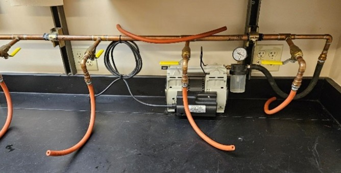
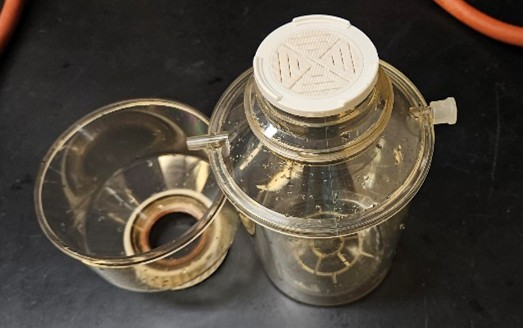
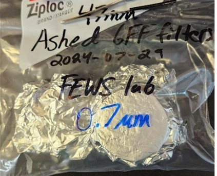
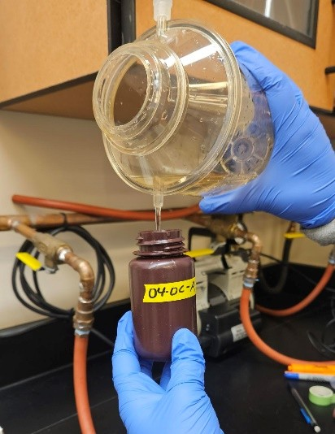
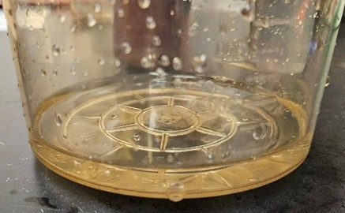
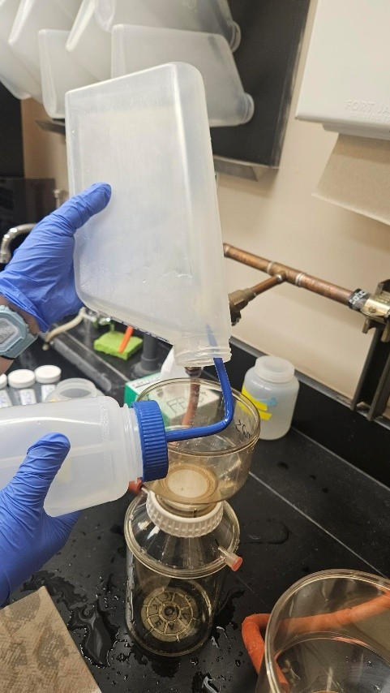
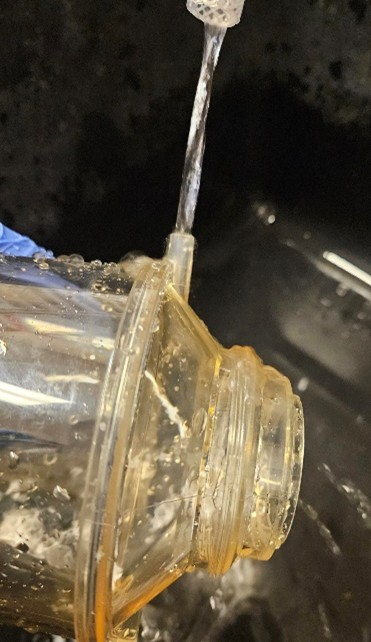

# General Filtering SOP

### FEWS Laboratory, PI: Kevin Bladon

#### Compiled by: Emily Nussdorfer

------------------------------------------------------------------------

## Materials

- **Filtration System:** Located on the south wall of RH273, this
  consists of a vacuum pump, copper manifold, valves with yellow hands,
  and red tubing. The yellow handles control the openings (**parallel to
  copper pipe is off, perpendicular to pipe is on**).

  <figure>
  
  <figcaption aria-hidden="FALSE">The two valves on the left are
  open.</figcaption>
  </figure>

- **Filtration apparatus:** including

  - the receiving container

  - filter disk

  - screw on funnel

  - (clear) stopper for the spout.

    

  > **Important:** the
  > filter disk and funnel cup both have orange/red O-rings on the
  > bottom, if they are missing the apparatus will have an inproper seal
  > and leak.

- **GF/F ashed-filters (combusted):** these are wrapped in foil and
  located: <!-- Needs location still -->

  - SSC (suspended sediment concentration) needs pre-weighed and labeled
    filters, but they **DO NOT** need to be ashed.

  - DOC (dissolved organic carbon) analysis (with or without SSC) needs
    ashed, labeled, and pre-weighed filters.

    

- **Blunt Tweezers:** In the cabinet above the filter station, or check
  nearby drawers if they aren’t in the cabinet. Use the blunt tweezers
  to not tear filters. Get a separate pair for moving the dirty filters.

- **Kim wipes and DI water bottle:** used to wipe down funnel/tweezers.

- **Nitrile gloves**

- **Labeled bottles for the filtered sample**

------------------------------------------------------------------------

# Procedure

## 1. Set Up

1.  Don gloves

2.  **If doing SSC analysis:** weigh full sample bottles **WITHOUT**
    caps and record weight on lab data sheet.

3.  **Before the first filtering:** Always pre-rinse a filter apparatus
    that were left in the cabinet (they accumulate dust). See below for
    rinsing procedure

4.  Set up the filtration apparatus: set the filter disk on top of the
    receiving container. This should be placed with the rough side up
    and the o-ring contacting the catch bottle.

5.  Using clean tweezers (rinse with DI water and wipe clean with a kim
    wipe) carefully remove a filter and carefully center it on top of
    the filter disk

6.  Record the filter number in the filtering data table.

7.  Screw the funnel piece onto the receiving container. Lightly press
    on the top while screwing the bottom corrugated plastic ring in
    place. Wipe any excess water on the funnel with a kimwipe. Make sure
    that the funnel is screwed on correctly and the O-rings are on the
    filter disk and funnel, or it will leak.

    > Tip: you can get the DI water during the sample rinse. Pour a
    > little sample in with the pump off and swirl the container to
    > catch the sides of the funnel

8.  Connect the red tubing to an open spout on the catch bottle. Ensure
    the clear stopper is covering the other spout or it won’t create a
    vacuum.

9.  Ensure the apparatus is in a stable location (the red tubing can
    bend/move by itself and get knocked over)

10. Check that the yellow handles on the vacuum valves are pointed in
    the correct direction. **Parallel to the copper pipe is open and
    perpendicular is closed.** Close the valves that aren’t being used
    or there will be no suction

11. Check if the vacuum trap (the clear chamber on attached to the inlet
    of the side of the vacuum pump) is empty. If it contains water,
    remove the trap and empty it before reattaching

12. Turn on the pump using the switch on the right side. Looking at the
    pressure gage on the pump, you want to aim for **25hg** and try not
    to exceed **30hg.**

## 2. Sample Rinse

1.  Agitate the raw sample (**invert 5 times**) with the cap on before
    pouring. Aim for the center of the funnel.

    

2.  Slowly pour until ~**50 ml** of sample has passed through the filter
    into the catch bottle (see image). **This is the sample rinse.**

    

3.  Turn the vacuum pump off. Wait a few seconds for the pressure to
    stabilize. Remove red tubing from the apparatus. Unscrew the funnel
    and set it on a clean kimwipe. Remove the filter disk (keeping the
    filter undisturbed) by holding it by the edges. Place on kimwipe.

4.  Over the sink gently swirl the receiving container to rinse the
    inside. Dump the water into the sink. The container is rinsed just
    **once.**

## 3. Sample Filtering

1.  Reassemble the filtration apparatus again before connecting it to
    the red tubing.

2.  Turn the vacuum pump on. Re-agitate your sample before slowly
    pouring until the sample runs out.

3.  Once the sample is depleted, disassemble the apparatus.

## 4. Sample Distribution

1.  Have your bottles ready for the filtered sample.

    > See **A1. Common Bottle Types** table in the appendices for bottle
    > types, how much to fill, and storage.

2.  Make sure bottle numbers are recorded along with the filter date.

3.  Pour about **5ml** of the filtered sample into its labeled bottle.
    You can use the spout or pour from the top.

    

4.  Shake vigorously, dump in your bottle rinse in the sink. Repeat
    until it’s rinsed **3 times.**

5.  Pour the amount of sample filtrate needed for the bottle type (look
    at the table) and repeat rinsing and pouring for the other bottles.

6.  Once all bottles are filled, any leftover sample filtrate can be
    dumped in to the sink.

7.  Place the bottles into their corresponding coolers, when you are
    done for the day put the coolers in their correct spot (either
    fridge or freezer). If you aren’t sure where they go, ask someone
    and leave them in the fridge for the time being.

## 5. SSC Analysis

1.  If doing SSC analysis rinse the filter to get leftover sediment out
    of the bottle.

    

2.  Make sure you have a tray ready covered in foil to place the filters
    on.

3.  Reassemble the filter apparatus. Make sure you have finished
    collecting the sample filtrate.

4.  Using a DI squirt bottle, squirt some DI water into the empty raw
    water sample bottle and agitate. Pour into the filter funnel. Repeat
    until the raw sample bottle has been rinsed 3 times.

5.  Other method of just holding bottle over filter and using a squeeze
    bottle to flush the dirt out.
    <!-- seems like more of a note, was highlighted?? -->

6.  the rinsed filter on the tin foil covered tray. With a marker write
    the filter number next to it.

7.  Place in drying oven at 105 degrees C for XX hours.
    <!-- Needs hours -->

    > Make sure the oven time has been scheduled on the Richardson
    > Outlook calendar

8.  The empty raw sample bottles that you just rinsed with DI water can
    be set aside to dry. **Do not** remove their labels. We usually hang
    them on the pegs above the sink. Be sure to leave a note

9.  Once dry, weigh the bottles without the caps and enter their empty
    bottle weight value into your notes.

## 6. Rinsing

1.  After each sample the apparatus needs to be rinsed

2.  Keep gloves away from the inside of filter apparatus to avoid
    contamination. **Don’t set the filter disk or funnel O-ring side
    down (part where it connects to the disk) in the sink. People use
    soap and dump dirt into the sink often.**

3.  Using DI water rinse the receiving container **three times.** Be
    sure to rinse the spouts out.

    - You can rotate the container on its side to get it rinsed out

    

4.  Rinse the funnel and filter disk off for about **10 seconds each**
    while rotating it.

5.  Shake the excess water off and set aside to dry.

------------------------------------------------------------------------

# Appendices

## A1. Common Bottle Types

### Storm Sampling

> **Important: Frozen
> sample bottles will expand or break if overfilled!**

| Analysis | Bottle Type | How Much Sample | Storage |
|----|----|----|----|
| Aqualog (DOM) | 30 mL or 125 mL | ~30 mL | Fridge |
| Shimadzu (TOC/TN) | 125 mL | ~80 mL (1 cm below neck). DO NOT OVERFILL. | Freezer |
| Levoglucosan | 20 mL (glass) | ~10 mL (1/2 full). DO NOT OVERFILL. | Freezer |
| CCAL (Nutrients) | 125 mL | ~80 mL (1 cm below neck). DO NOT OVERFILL. | Freezer |
| Excess - Drinking Water Treatment Testing (Node 3) | 500 mL | Whatever is left over. | Fridge |

## A2. Post Run Clean Up

> **Important: Check
> with project lead before dumping any sample!**

| Analysis | Bottle Type | What to Do when Analysis is Complete |
|----|----|----|
| Aqualog (DOM) | 30 mL or 125 mL | Dump once it’s been confirmed there aren’t any reruns. |
| Shimadzu (TOC/TN) | 125 mL |  |
