```{r setup, include=FALSE}
knitr::opts_chunk$set(echo = TRUE)
source("helper-funs.R")
require("openxlsx2")
require("here")
```

# 1. Input Sampling Info

## Study and Site Info

-   **`study`:** 4-5 letter code associated with the study
-   **`samp_type:`** type of sample being collected
    -   `GB`: Grab samples
    -   `IS`: ISCO samples
    -   `SS`: Soil sample
-   **`rn`:** The number to start the random number sequence. This is used to assign a random analysis order.

```{r study-info}
study <- "SONDE"
samptype <- "GB"
rn <- 1
```

## Sampling Info

### Grab Samples

*(only required if `samp_type` is "GB")*

-   **`sites`:** One of the following options:

    -   File path to a `.csv` of site names where the first column is the site names.

    -   To leave the site names blank, use `"___"` instead.

-   **`start`:** Either a line for a fully blank label (`"_____________"`) or a date followed by a line for the time (ie. `"YYYYMMDD_____"`)

-   **`nsamp`:** The number of samples per site. Typically this will be one but can be used to generate multiple blank labels.

```{r grab-sample-info}
if(samptype == "GB"){
  sites <- "___"
  start <- "_____________"
  nsamp <- 30
}
```

### ISCO Samples

*(only required if `samp_type` is "IS")*

-   **`sites`:** A vector of site names (ie. `c("STA","COA")`)

-   **`nsamp`**: The number of samples that will be collected at each site. Should either be a single number if consistent across sites, or formatted as a vector the same length as the number of sites (ie. `c(24,24)`)

-   **`interval`**: The number of hours between each sample taken. Should either be a single number if consistent across sites, or formatted as a vector the same length as the number of sites (ie. `c(2,2)`)

-   **`start`:** The start time to use on the labels, either:

    -   A vector with the start time(s) if known formatted as YYYY-MM-DD HH:MM. Should either be a single character if consistent across sites, or formatted as a vector the same length as the number of sites (ie. `c("2026-02-23 15:00","2026-02-23 17:00")`)

    -   If the start time is unknown use either a line for a fully blank label or a date followed by a line for the time (ie. `"YYYYMMDD____"`)

```{r isco-sample-info}
if(samptype == "IS"){
  sites <- c("STA","COA")
  nsamp <- c(24,24)
  interval <- c(2,2)
  start <- c("2026-02-23 15:00","2026-02-23 17:00")
  #start <- "20260223____"
}
```

## Blanks

**There are two types of blanks you may want to include:**

-   **laboratory blanks (`nLB`)**: Blanks that test for contamination throughout the sample processing steps.

-   **field blanks (`nFB`)**: Blanks that test for contamination throughout the entire sample collection process in the field through the analysis.

Specify the number to include below.

```{r blanks}
nLB <- 0
nFB <- 0
```

## Analysis Info

Logical (`TRUE`/`FALSE`) for which analysis will be performed on the samples:

-   **`DOM`:** dissolved organic matter composition on the Aqualog
-   **`DOC`:** dissolved organic carbon on the Shimadzu
-   **`CCAL`:** additional analytes sent to outside labs
-   **`Levoglucosan`:** levoglucosan to be archived for future analysis
-   **`BPCA`:** benzenepolycarboxylic acid to quantify black carbon
-   **`Excess`:** additional sample collected for other purposes (ie., sending to Node 3)

```{r analysis-info}
DOM <- FALSE
DOC <- TRUE
CCAL <- FALSE
Levoglucosan <- FALSE
BPCA <- FALSE
Excess <- FALSE

#store as a vector to more easily pass off 
  analyses <- c(AQ = DOM, CN =DOC, NU = CCAL, LV = Levoglucosan, 
                BC = BPCA, EX = Excess)
```

## Export Location

Specify where to export the spreadsheet with the sample names and datasheets.

**`saveloc`:** the filepath to the location to save the excel file (`.xlsx`) to.

```{r export-info}
saveloc <- "example-sample-labels.xlsx"
```

# 2. Populate the Labels and Data Sheets

## Create the SampleIDs

Before creating the labels we will create the sample ID's based on the provided information.

```{r generate-ids include=FALSE}
set.seed(9) #keep the randomization the same each time the code is run. 

ids <- generate_ids(study, samptype, sites, start, nLB, nFB, rn, nsamp, interval)
create_datasheets(ids, saveloc, type="ids")
```

## Create the Labels

After generating the sample ID information, we can create the information needed to put on the printed labels. There are two sets of labels:

-   **Field Labels:** These will go on ISCO bottles or samples collected in the field. The time and/or date of collection on these labels may be blank.

-   **Lab Labels:** These will go on alliquots of the original sample stored for various analyses. These labels should only be printed [after]{.underline} sample collection to ensure the correct date and time have been included on the label.

    > If your initial collection timing was unknown, fill out the date and time of sample collection in the `Date (YYYYMMDD)` and `Time (HHMM)` columns of your spreadsheet on the `Sample-DateTime` sheet. If you have field blanks, update with the date and time of "collection". For analytical blanks use the date and time the blank was "created".

```{r create-labels include=FALSE}
create_datasheets(ids, saveloc, type="fieldlabel")
create_datasheets(ids, saveloc, type="lablabel", analyses)
```

## Create the Data Sheets

We can also create some pre-populated datasheets once we've generated the full sample ID's. These include the following sheets within the excel document:

-   **DS-Filter Weight:** Records the filter weights before and after filtering to calculate TSS concentrations.

-   **DS-ISCO Bottle Weight:** Records the bottle weights of the ISCO bottles, used to calculate TSS concentrations.

-   **DS-Bottle Numbers:** Records the bottle numbers of the analytical subsets for each sample.

```{r create-datasheets include=FALSE}
create_datasheets(ids, saveloc, type="datasheet", open =TRUE, quiet=FALSE)
```

# 3. Print Out Labels

After running the following code you should find a word template for the labels named `study-bottle-labels.doc` in the same location as the datasheet template. Follow the instructions below to populate the labels for printing.

```{r copy-label-template include=FALSE}
copy_label_template(saveloc, study, "lab")
copy_label_template(saveloc, study, "field")
```

1.  Open the bottle label template file. Click **Enable Content** in the yellow bar at the top. This will allow the macros to color the labels to run.

2.  Navigate to the **Mailings** tab in Word click **Start Mail Merge**, select **Labels**.

    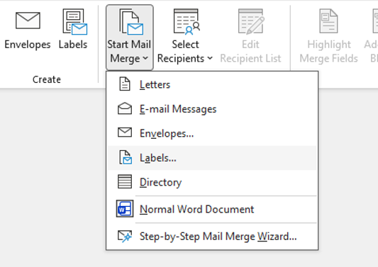{width="393"}

3.  Once it opens up the popup, **hit cancel and exit the window**. *If you hit OK it deletes the template and opens a new window and the format gets messed up.*

    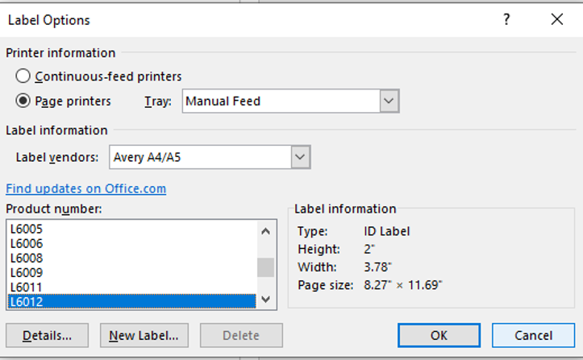{width="484"}

4.  Click **Select Recipients** and **Use an Existing List.**

    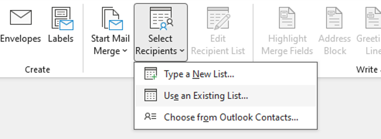{width="428"}

5.  Navigate to your saved Excel file with the label information and datasheets. Click **Open**.

6.  It will ask you to select which tab on your mailing list you are using.

    -   For printing **field labels** choose `Labels-Field`

    -   For printing **lab labels** choose `Labels-Lab`

    -   Click **OK**.

    > **Note:** Sometimes the window will shows doubles of your tabs. Not sure why. **Just click the top one.** It will still work.

7.  Click **Insert Merge Field.** Then follow the specific directions below if you're printing out [field labels] or [lab labels].

## Field Labels  

1.  Choose **Sample_Name**. Then center the field in the center of the label and bold it.

    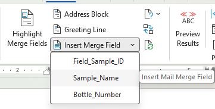

2.  If this is for ISCO samples, press space and enter to get to a new line, then go back to **Insert Merge Field** and choose **Bottle_Number**.

3.  Change the font to **Consolas**. Make the font size of the sample name 12 pt. The bottle number can stay the default size. The fields should look like this:

    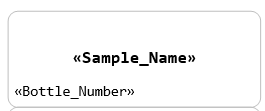

4.  You can click the **Preview Results** button to check that that the label looks correct. Once you're happy with it, click the **Update Labels** button.

5.  Click **Finish & Merge** then **Edit Individual Document**. It will prompt you to select the Merge records. Keep the default (all) and hit OK. This will open a new word document file with all your labels on it.

    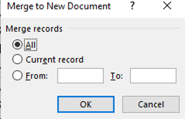{width="258"}

6.  To enhance clarity in the field, we will color the site name in red. Under the **Editing** tab, locate the **Replace** button.

    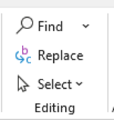{width="106"}

7.  Put the first site name in both the **Find what:** and **Replace with:** sections. Then in the bottom left corner click **More \> \>** and then **Format** in the bottom left. Click **Style** and select the **SiteID** style. Ensure this shows up below the **Replace with**: box. Click **Replace All.**

    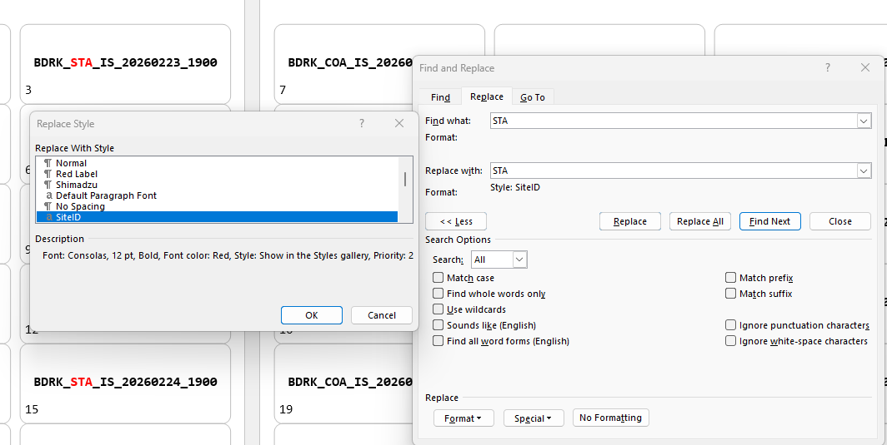{width="541"}

    > **Hint:** You can also use match prefix if you have many sites. To do this click **Match prefix** option and type your prefix (e.g., MCSN) followed by **\^&**.

8.  Repeat for all your sites. The final labels should look like

    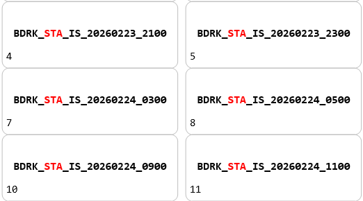{width="410"}

9.  Print.

## Lab Labels

1.  Choose **Sample_Name**. Then center the field in the center of the label.

    

2.  On a new line, add the **Lab_Sample_ID** and make it bold. Add two spaces and add the **Analysis.**

3.  Change the font to **Consolas**. Make the font size of the sample ID and analysis 13 pt. It will look like this puts it on two lines, but it should be on a single line if you **Preview Results**.

    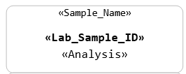

4.  You can click the **Preview Results** button to check that that the label looks correct. Once you're happy with it, click the **Update Labels** button.

5.  Click **Finish & Merge** then **Edit Individual Document**. It will prompt you to select the Merge records. Keep the default (all) and hit OK. This will open a new word document file with all your labels on it.

    {width="215"}

6.  To enhance clarity we will color the analyses. To do this can you run a macro which will automatically recolor all the analyses. Go to **View** then **Macros** and select **View Macros** and select **Color_Analyses** then hit Run. This should make all the analyses names a unique color.

    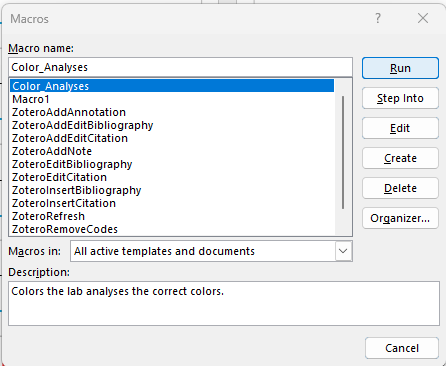

7.   The final labels should look like

    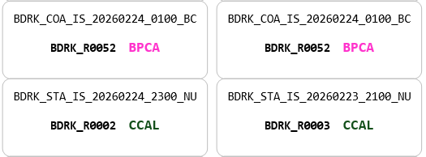

8.  Print.

> **Note:** The template is set up to print labels to **Avery 5520 Address Labels**. If you need to print to a different label size you will need to modify the template.

# 4. Print Out Datasheets

1.  To print out the datasheets required for the project, open the excel document. Navigate to the sheet you want to print out. All of the datasheet sheets start with **DS-**.

2.  Click `File` in the top toolbar.

3.  Click `Print` on the left toolbar.

4.  Check that the print preview looks correct. It should be set to the correct defaults.

5.  Click the `Print` button after selecting the correct printer.

6.  Repeat steps 1-5 for any datasheets required for the sampling event.

# 
